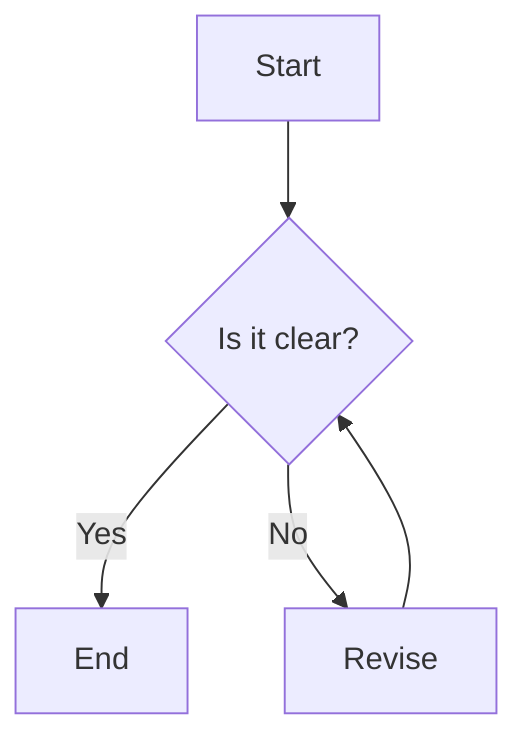

# Mermaid Diagram Example

This is a sample Mermaid diagram in a GitHub Markdown file:



graph TD2;
    A[Start] --> B{Is it clear?};
    B -->|Yes| C[End];
    B -->|No| D[Revise];
    D --> B;
```
